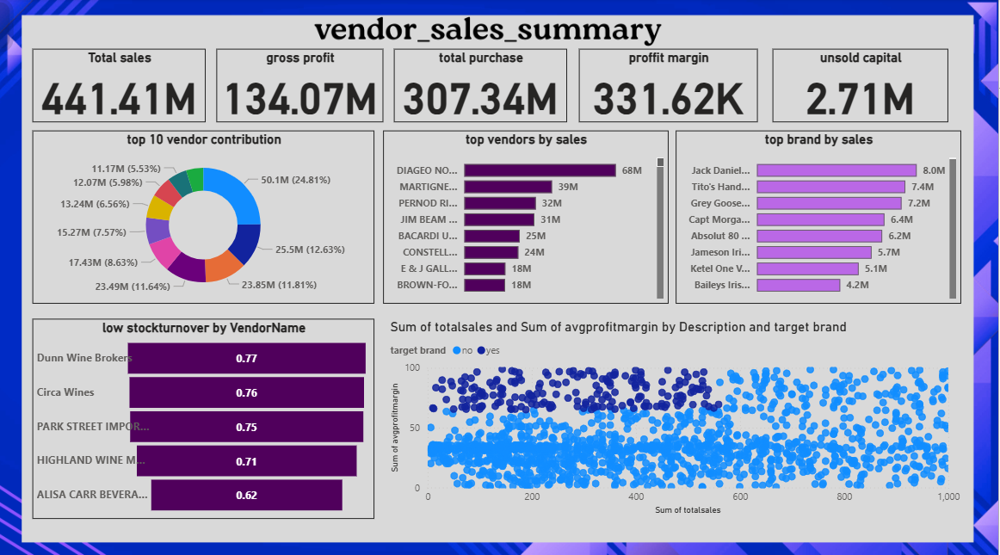

# Vendor Performance Analysis - Retail Inventory and sales

_Analyzing vendor efficiency and profitability to support strategic purchasing and inventory decisions using sql,python and Power BI._

---

## Table of contents

- <a href = "#overview">Overview</a>
- <a href = "#business-problem">Business Problem</a>
- <a href = "#dataset">Dataset</a>
- <a href = "#tools-technologies">Tools & technologies</a>
- <a href = "#project-structure">Project Structure</a>
- <a href = "#data-cleaning-preparation">Data cleaning &preparation</a>
- <a href = "#exploratory-data-analysis-eda">Exploratory data analysis (EDA)</a>
- <a href = "#research-questions-key-findings">Research questions and key findings</a>
- <a href = "#dashboard">Dashboard</a>
- <a href = "#how-to-run-this-project">How to run this Project</a>
- <a href = "#final-recommendations">Final recommendations</a>
- <a href = "#author-contact">Author contact</a>

---

<h2><a class="anchor" id= "overview"></a>Overview </h2>

this project evaluates vendor performance and retail inventory dynamics to drive strategic insights for purchasing ,pricing, and inventory optimization . A complete data pipeline was built using sql for ETL , python for analysis and hypothesis testing , power BI for visualization.

---

<h2><a class="anchor" id= "business-problem"></a>Business Problem </h2>

Effective inventory and sales management are crucial in the retail sector. this project aims to :

- identifying underperforming brands needing pricing or promotional adjustments
- Determine vendor contribution to sales and profits.
- Analyze the cost -benefit of bulk purchasing.
- Investigate inventory turnover inefficiences.
- Statistically validate differences in vendor profitability.

---

<h2><a class="anchor" id= "dataset"></a>Dataset </h2>

- Multiple csv files are located in `/data/` folder (sales,inventory,vendors)
- summary table created from ingested data and used for analysis

---

<h2><a class="anchor" id= "tools-technologies"></a>Tools & Technologies </h2>

- SQL (common table expressions, joins,filtering)
- Python( pandas,numpy,matplotlib,seaborn,sqlite3)
- Power BI ( interactive visuals)
- github

---

<h2><a class="anchor" id= "project-structure"></a>Project Structure </h2>

```text
.
├── .gitignore
├── README.md
├── vendor_sales_analysis_report.pdf
│
├── dashboard/                  # power bi dashboard file
│   └── vendor_sales_summary.pbix
│
├── images/                   # screenshot of power bi file
│   └── Screenshot 2025-08-31 134601.png
│
├── notebooks/               # jupyter notebooks
│   ├── data_cleaning.ipynb
│   ├── ingestiondb.ipynb
│   └── vendor_performance_analysis.ipynb
│
└── scripts/    # python scripts for ingestion and processing
    ├── get_vendor_summary.py
    ├── get_vendor_summary1.py
    └── ingestion_db.py

```

---

<h2><a class="anchor" id= "data-cleaning-preparation"></a>Data-cleaning-preparation</h2>

- Removed transactions with:
  - gross profit <= 0
  - margon profit <= 0
  - sales quantity = 0
- created summary table with vendor level metrics
- converted data types, handled outliers, merged lookup tables

---

<h2><a class="anchor" id= "exploratory-data-analysis-eda"></a>Exploratory data analysis (EDA)</h2>

**Negative or zero values detected :**

- gross profit : min -52,000.78 ( loss-making-sales)
- profit margin : min -infinity (sales at zero or below cost)
- unsold inventory : indicating slow moving stock

**outliers identified**

- high freight cost upto 257k
- large purchses/actual prices

**correlation analysis**

- weak between purchase price and profit
- strong betweeen purchase quantity and sales quantity ( 0.9999)
- negative between profit margin and sales price (-0.179)

---

<h2><a class="anchor" id= "research-questions-key-findings"></a>Research questions and key findings</h2>

1. **Brands for promotions** : 198 brands with low sales and high profit margins
2. **Top vendors** : top 10 vendors = 66.00% of purchases - risk of over-reliance
3. **bulk purchasing impact** : 72 % cost savings per unit in large orders
4. **inventory turnover** : 2.73 m worth of unsold inventory
5. **vendor profitability** :
   - high vendors mean margin is 31.18
   - low vendors mean margin is 37.77
6. **hypothesis testing ** : statistically significance difference in profit margin - distinct vendor strategies

---

<h2><a class="anchor" id= "dashboard"></a>Dashboard</h2>

- power bi dashboard show
  - vendor wise sales and margins
  - inventory turnover
  - bulk purchasing savings
    -performance heatmaps



---

<h2><a class="anchor" id= "how-to-run-this-project"></a>How to run this Project</h2>

1. clone the repository

```bash
git clone = https://github.com/prakashh2822/vendor-performance-analysis-sql-python-powerbi.git
```

2. load the csv and inges into database

```bash
python = scripts/ingestion_db.py
```

3. create vendor summary table

```bash
python  scripts/get_vendor_summary1.py
```

4. open and run notebooks:

```bash
 - notebooks/data_cleaning.ipynb
 - notebooks/vendor_performance.ipynb
```

5. open powerbi dashboard

```bash
 - dashboard/vendor_sales_summary.pbix
```

---

<h2><a class="anchor" id= "final-recommendations"></a>final recommendationst</h2>

- diversify vendor base to reduce risk
- optimize bulk order strategies
- reprice slow-moving ,high margins brands
- clear unsold inventory strategically
- improve marketing for underperforming vendors

---

<h2><a class="anchor" id= "author-contact"></a>Author contact</h2

**Vallepu Omprakash**

Data Analyst

email = vallepuomprakash@gmail.com


